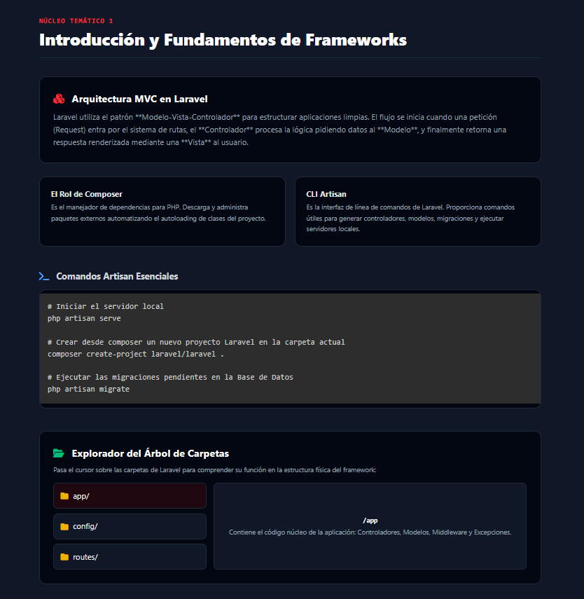
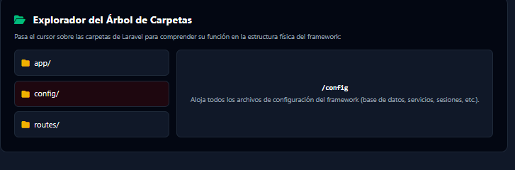
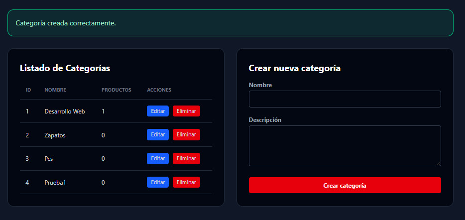
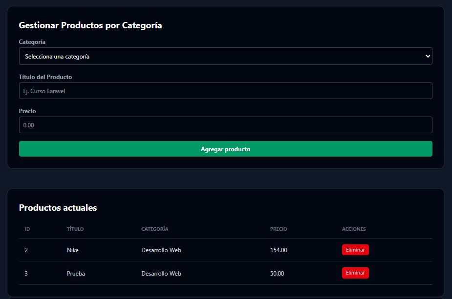
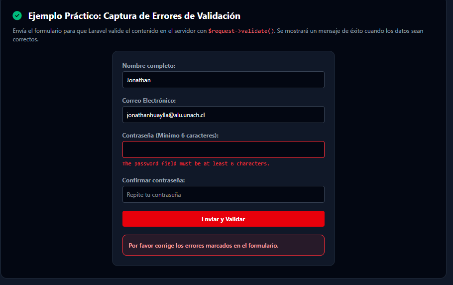

# Evaluacion_2_Laravel
- Integrantes Del grupo: Rafael Aruti y Jonathan Huaylla
## Introducción

Este proyecto es una aplicación Laravel que utiliza e explica los conceptos fundamentales tales como: Eloquent ORM, migraciones, seeders, validación y formularios Blade. Para cumplir con los requerimientos de nuestra segunda evaluacion de nuestro curso de laravel.

## Requisitos previos

- PHP 8.1 o superior
- Composer
- Una base de datos tal sea: MySQL, MariaDB, SQLite, PostgreSQL
- Node.js y npm (opcional para activos y Vite)

## Instalación de Laravel y dependencias

1. Clona el repositorio o descarga el proyecto.

- Esto se puede hacer desde el mismo github copiando la URL o por la aplicacion Github Desktop

2. En la carpeta del proyecto, instala dependencias PHP con Composer:

```bash
composer install
```

3. Copia el archivo de entorno y ajusta la configuración de la base de datos:

```bash
cp .env.example .env
```

4. Genera la clave de la aplicación:

```bash
php artisan key:generate
```

5. Configura los datos de conexión a la base de datos en el archivo `.env`:

```dotenv
DB_CONNECTION=mysql
DB_HOST=127.0.0.1
DB_PORT=3306
DB_DATABASE=nombre_basedatos
DB_USERNAME=usuario
DB_PASSWORD=contraseña
```

## Migraciones, seeders y datos de prueba

1. Ejecuta las migraciones para crear las tablas:

```bash
php artisan migrate
```

2. Si deseas poblar con datos de prueba, ejecuta los seeders:

```bash
php artisan db:seed
```

3. Para reiniciar la base de datos y ejecutar migraciones y seeders en limpio:

```bash
php artisan migrate:fresh --seed
```

## Instalación de activos y compilación (opcional)

Si el proyecto usa Vite y activos frontend, instala npm y compila los recursos:

```bash
npm install
npm run dev
```

## Ejecución local

Inicia el servidor de desarrollo de Laravel:

```bash
php artisan serve
```

Luego abre el navegador en `http://127.0.0.1:8000`.

## SQL: Crear tablas y poblar datos de prueba (MySQL)

```sql
CREATE TABLE IF NOT EXISTS `categorias` (
	`id` BIGINT UNSIGNED NOT NULL AUTO_INCREMENT PRIMARY KEY,
	`nombre` VARCHAR(255) NOT NULL,
	`descripcion` TEXT NULL,
	`created_at` TIMESTAMP NULL,
	`updated_at` TIMESTAMP NULL
) ENGINE=InnoDB DEFAULT CHARSET=utf8mb4 COLLATE=utf8mb4_unicode_ci;

CREATE TABLE IF NOT EXISTS `productos` (
	`id` BIGINT UNSIGNED NOT NULL AUTO_INCREMENT PRIMARY KEY,
	`categoria_id` BIGINT UNSIGNED NOT NULL,
	`titulo` VARCHAR(255) NOT NULL,
	`precio` DECIMAL(8,2) NOT NULL DEFAULT 0.00,
	`created_at` TIMESTAMP NULL,
	`updated_at` TIMESTAMP NULL,
	CONSTRAINT `fk_producto_categoria` FOREIGN KEY (`categoria_id`) REFERENCES `categorias`(`id`) ON DELETE CASCADE
) ENGINE=InnoDB DEFAULT CHARSET=utf8mb4 COLLATE=utf8mb4_unicode_ci;

INSERT INTO `categorias` (`id`,`nombre`,`descripcion`,`created_at`,`updated_at`) VALUES
(1,'Desarrollo Web','Cursos y proyectos con Laravel y bases de datos relacionales',NOW(),NOW()),
(2,'Bases de Datos','Ejercicios y ejemplos de SQL',NOW(),NOW()),
(3,'Testing','Pruebas y PHPUnit',NOW(),NOW());

INSERT INTO `productos` (`categoria_id`,`titulo`,`precio`,`created_at`,`updated_at`) VALUES
(1,'Manual Laravel 12',0.00,NOW(),NOW()),
(1,'Curso Laravel Avanzado',199.99,NOW(),NOW()),
(2,'Introducción a SQL',29.99,NOW(),NOW());

```

### Ejecutar este bloque SQL

1) Usando el cliente `mysql` (línea de comandos)

Guarda el SQL en un archivo, por ejemplo `nt4_seed.sql`, y luego ejecuta:

```bash
# (opcional) crear la base de datos si no existe
mysql -u root -p -e "CREATE DATABASE IF NOT EXISTS nombre_basedatos CHARACTER SET utf8mb4 COLLATE utf8mb4_unicode_ci;"

# Importar el archivo SQL en la base de datos
mysql -u usuario -p nombre_basedatos < nt4_seed.sql

# Alternativa: entrar al cliente y usar SOURCE
mysql -u usuario -p nombre_basedatos
mysql> SOURCE /ruta/al/nt4_seed.sql;
```

2) Usando phpMyAdmin

- Accede a phpMyAdmin en tu navegador e inicia sesión.
- Selecciona la base de datos `nombre_basedatos` en la columna izquierda (o créala desde el panel "Bases de datos").
- Ve a la pestaña "SQL" y pega el contenido del bloque SQL, o utiliza la pestaña "Importar" y sube el archivo `nt4_seed.sql`.
- Ejecuta la consulta/importación. phpMyAdmin mostrará mensajes de éxito o errores.

Nota: si truncas tablas manualmente recuerda desactivar y reactivar `FOREIGN_KEY_CHECKS` como se muestra arriba.

## Notas

- Laravel usa Composer para gestionar dependencias PHP.
- `php artisan` es la herramienta de línea de comandos para migraciones, seeders y servidor.
- El archivo `.env` contiene la configuración del entorno y no debe compartirse.

# Evidencia Visual 

- Nucleo Tematico 1


Usando la otra opcion


- Nucleo Tematico 2


Poniendo otra Ruta


- Nucleo Tematico 3


Poniendo en desactivado


- Nucleo Tematico 4
Creando categoria de prueba


Eliminando Categoria


Producto añadido


Producto Eliminado


- Nucleo Tematico 5
Validacion de formulario


Probando Errores de validacion


---

## Resumen de pruebas por Núcleo (después de las imágenes)

- **Núcleo 1:** Se probó `composer install`, `php artisan serve` y `php artisan migrate`. Resultado: dependencias instaladas, servidor accesible en `http://127.0.0.1:8000` y tablas creadas correctamente cuando `.env` estaba configurado.

- **Núcleo 2:** Se probó el paso de parámetros en rutas (ej. `unach`,`Umas`) y rutas protegidas con `middleware('auth')`. Resultado: parámetros capturados/encodificados correctamente; rutas protegidas redirigieron (302) al login cuando no había sesión.

- **Núcleo 3:** Se probó la compilación de directivas Blade (`@if`) y el escapado de variables. Resultado: HTML compilado correcto (`<p>Servidor Activo</p>` en la demo); variables con HTML se escaparon evitando inyección.

- **Núcleo 4:** Se probó crear/editar `Categoria`, crear `Producto`, validaciones y eliminación en cascada. Resultado: categoría `Desarrollo Web` insertada; producto `Manual Laravel 12` insertado; envío con `nombre` vacío disparó validación `required`; borrar categoría eliminó sus productos (ON DELETE CASCADE).

- **Núcleo 5:** Se probó protección CSRF y validaciones (`required`, `email`, `min`, `confirmed`) con `$request->validate()`. Resultado: envío sin `@csrf` devolvió error 419; email inválido y confirmación de password activaron mensajes; datos válidos mostraron `session('success')`.
